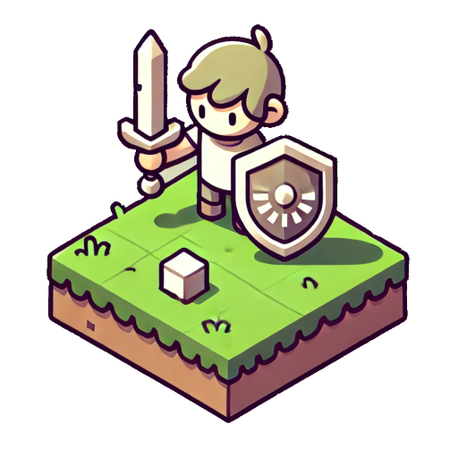

# **fe-phaser-poc-isometric-rpg**

<p align="center">
  
</p>

[](./LICENSE)
[](#)


**fe-phaser-poc-isometric-rpg** is a proof of concept based on Phaser for an isometric RPG game.

## **Table of Contents**

- [Introduction](#introduction)
- [Features](#features)
- [Requirements](#requirements)
- [Installation](#installation)
- [Usage](#usage)
- [Project Structure](#project-structure)
- [Key Dependencies](#key-dependencies)
- [Testing](#testing)
- [License](#license)
- [Contact](#contact)

## **Introduction**

**fe-phaser-poc-isometric-rpg** is an application developed in TypeScript that uses Phaser to create an RPG game environment with isometric projection. This project includes:

- Random map generation.
- Smooth player animations.
- Scalability for different screen sizes.
- Use of assets defined in JSON format.

## **Features**

- ✅ Isometric map rendering.
- ✅ Random terrain generation.
- ✅ Player animations for movement in four directions.
- ✅ Keyboard input support (WASD and arrow keys).
- ✅ Dynamic screen resizing.

## **Requirements**

- **Node.js**: `>= 20.18.0`
- **Yarn**: `>= 4.5.1`

## **Installation**

### Steps:

1. Clone the repository:
   ```bash
   git clone https://github.com/5h1ngy/fe-phaser-poc-isometric-rpg.git
   cd fe-phaser-poc-isometric-rpg
   ```

2. Install dependencies:
   ```bash
   yarn install
   ```

3. Start the development server:
   ```bash
   yarn start:dev
   ```

To create a production build:
```bash
yarn build:prod
```

## **Usage**

- The project generates an isometric map with random elements defined by `tileFrames`.
- The player can be controlled using the **W, A, S, D** keys or the **arrow keys**.
- The camera automatically follows the player while exploring the map.

## **Project Structure**

```plaintext
public/
├── assets/          # Static assets (spritesheets, tilesets, manifest JSON, etc.)
src/
├── main.ts          # Main entry point for the game
├── vite-env.d.ts    # Vite types
├── ...              # Other source files
```

## **Key Dependencies**

- **Phaser**: 2D game framework.
- **TypeScript**: For type-safe and secure development.
- **Vite**: Modern bundler for frontend applications.
- **dotenv**: For environment variable management.
- **gsap**: For advanced animations (potentially integrable into the project).

For a full list of dependencies, see the [package.json](./package.json).

## **Testing**

Currently, the project does not include automated tests, but they can be integrated using frameworks like **Jest** or **Cypress**.

## **License**

This project is released under the [MIT License](./LICENSE).

## **Contact**

- **Repository**: [GitHub](https://github.com/5h1ngy/fe-phaser-poc-isometric-rpg)
- **Author**: 5h1ngy
- **Portfolio**: [5h1ngy-dev](https://5h1ngy-dev.click/)

